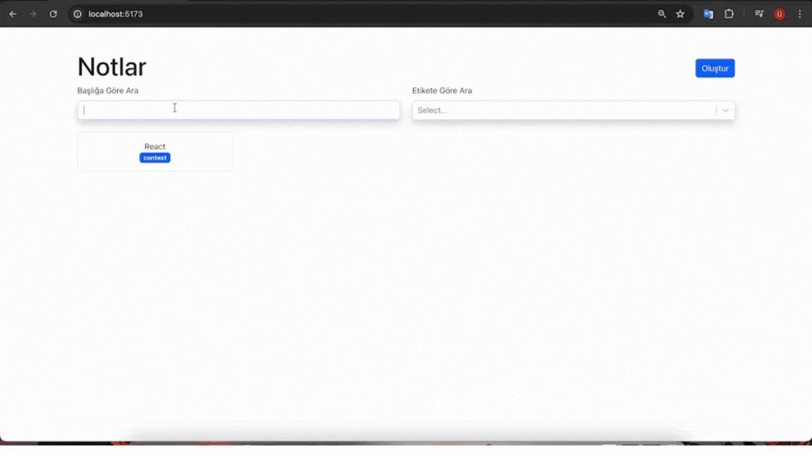

<h1>Typescript Note-App</h1>

Bu proje React ve Typescript kullanılarak oluşturulmuş bir projesidir.

Kullanılan özellikler;

- Bootstrap, React-Bootstrap

- React-Router-Dom

- React-Select

- React-Markdown

- uuid

Projenin bize sunduğu özellikler;

- Ana ekranda bizi notların listelendiği ve notları filtreleme alanı bulunmaktadır,

- Filtreleme alanında başlığa veya etikete göre filtreleme yapabiliriz.

- Oluştur butonuyla bizi url e gönderdiği new parametreli sayfaya yönlendiriyor.

- Bu sayfada yeni bir not ekleyebilir ve eklerken daha önce eklenmiş etiketleri görebilir ve seçebiliriz.

- Note cardlara tıklandığında bizleri notun id'sine göre detay sayfasına yönlendiriyor,

- Burada note'un detaylarını görebiliriz. Notun içerik alanı için kullandığımız react-markdown sayesinden yazı düzenimizi stillendirebiliriz.

- Noteları buradan silebilir veya düzenleme ekranına geçebiliriz.

- Düzenleme ekranında, değişiklik yapabilir veya iptal edebiliriz.

<h2>Kullanılan Diller</h2>

Bu projede React ve Typescript kullanılmıştır

<h2>Ekran Videosu</h2>

